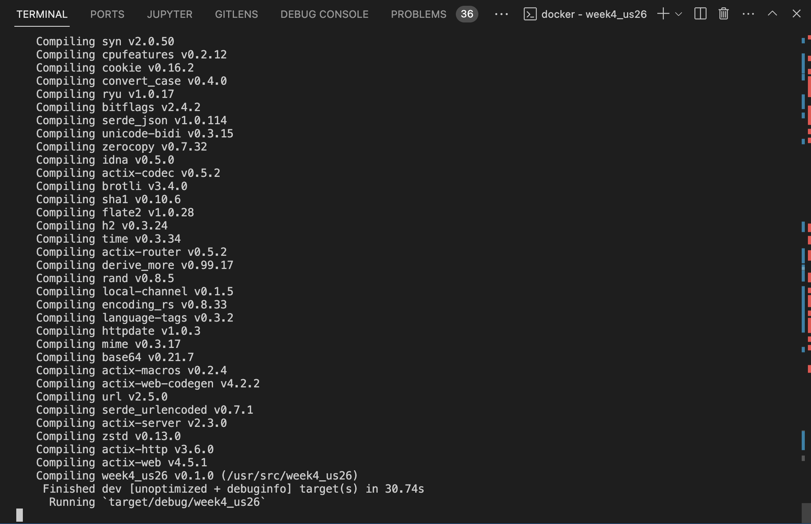
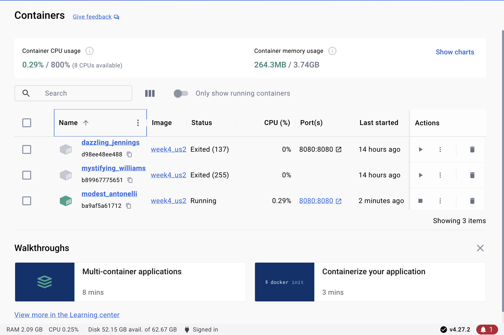
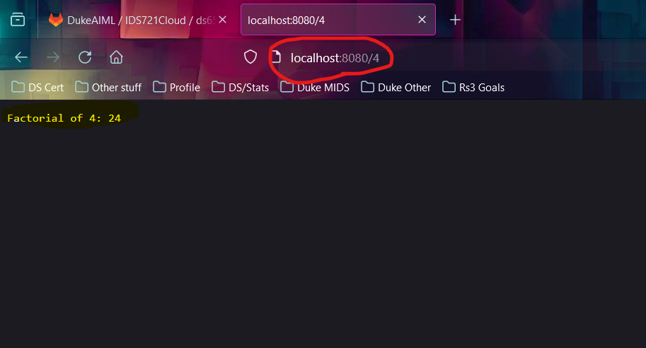
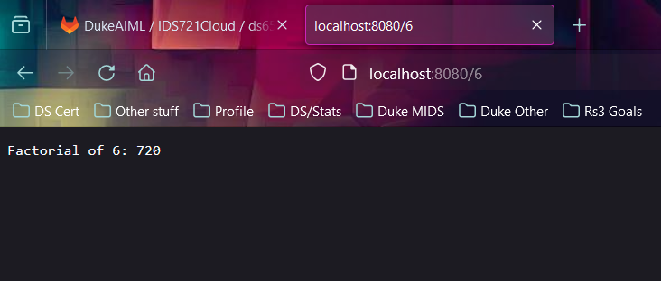

# Week4 Mini Project - Divya Sharma (ds655)

### Creating a Docker Container for a Rust Actix Web Service

The objective of this project is to encapsulate a Rust Actix web service in a Docker container. This web service calculates the factorial of a number provided in the URL.

### Packages and Dependencies
To install Docker:

1 - Go to the official Docker website: [Docker Official Website.](https://docs.docker.com/desktop/)

2 - Follow the instructions provided to download and install Docker for your operating system.

### Build and Deploy the Project

Follow these steps to build and deploy the project:

1 - Run the following command to create a new blank Rust project:

    cargo new week4

2 - Update the code in the /src/main.rs file to add functionalities to the Rust function.

3 - Add dependencies to the Cargo.toml file.

    actix-web = "4" and rand = "0.8"

4 - Run the following command to test whether the main function works locally:

    cargo run

5 - Open the Docker console and ensure that Docker Desktop is running.

6 - Write the Dockerfile to specify the steps including FROM, WORKDIR, USER, COPY, RUN, EXPOSE, and CMD.

7 - Build the Docker image by running the following command in the terminal:

    docker build -t week4 .

8 - Run the Docker container by executing the following command:

    docker run -p 8080:8080 week4

9 - Running the Container
After building the Docker image, run the container using the following command:

    docker run -p 8080:8080 week4

10 - Access the Actix web service by navigating to http://localhost:8080/number in your web browser, replacing `number` with the number you want to calculate the factorial of.

### Results

Compiling the Rust code
```
cargo build
```




Building the Docker image:
```
    docker build -t week4 .
```


Docker Image on local Dockerhub




Deployment:

Run `http://localhost:8080/{number}` in your web browser.





